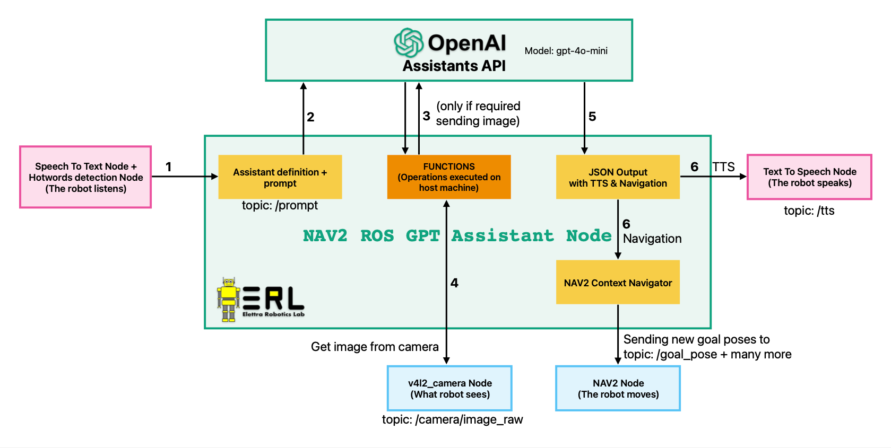

# Nav2 ros gpt assistant

A ROS2 node that uses [OpenAI GPT Assistants API](https://platform.openai.com/docs/assistants/overview) to generate
navigation instructions for NAV2.

## How it works



This node expects a string message on the `/prompt` topic.

A TTS (Text To Speech) output is published on the `/tts` topic.

The node interacts with NAV2 by publishing goal poses on the `/goal_pose` topic, extending the BasicNavigator NAV2
class.

If needed by the prompt, it can automatically "Take a photo" from the topic `/camera/image_raw` and send it as a context
to the assistant. Step 3 of the graph is only executed if the assistants require more context to generate the answer.
For more detail see [function calling](https://platform.openai.com/docs/assistants/tools/function-calling).

A web panel is also available but is not part of this repository.

## Example - Prompt of the RoboCup 2024 @Home Education

We ([@vellons](https://github.com/vellons), [@frovaaa](https://github.com/frovaaa), 
[@BiceMar](https://github.com/BiceMar)) participated at the RoboCup 2024 Worldwide Championship in the @Home Education
category, as part of The Elettra Robotics Team.
We won the 1st place in the competition with our robot TOPO (Tomato Onion Pizza Orecchiette) 🐁🤖🇮🇹🌍🏆.

This repository was used in the final demonstration during the competition. A video is available below.

[](https://www.youtube.com/watch?v=pPosL4wT-Qk)


#### Output during the demonstration

The assistant was created with the file: `openai_robocup_2024_assistant_create_or_update.py`

```json
You: "I would like to buy something, what do you have on the table?"
Executing: "get_image_from_camera"
Assistant: {
  "tts": {
    "lang": "en"
    "text": "On the table, we have bright green shirt with RoboCup Eindhoven 2024 printed on it, a microphone, a pair of black shoes..."
  }
}

You: "I would like to see some matches, can you bring be there"
Assistant: {
  "navigation": {
    "action": "go_to_location",
    "location_key": "SOCCER",
    "coordinates": null
  },
  "tts": {
    "lang": "en",
    "text": "Let's head to the soccer field to see some matches! I'll take you to there right away!"
  }
}

You: "Go forward by 1 meter"
Assistant: {
  "navigation": {
    "action": "go_to_location",
    "location_key": null,
    "coordinates": [{
      "x": 1.0,
      "y": 0.0,
      "angle": null
    }]
  },
  "tts": {
    "lang": "en",
    "text": "One step at a time! Forward one meter!"
  }
}

You: "I forgot something at the shop"
Assistant: {
  "navigation": {
    "action": "go_to_location",
    "location_key": "SHOP",
    "coordinates": null
  },
  "tts": {
    "lang": "en",
    "text": "No problem! Let's go back to the shop so you can get your forgotten item."
  }
}
```

## Creating and chatting with the assistant

This is useful to test the assistant without the need of ROS2.

Set up the OpenAI API key and project id in the environment variables.
Then run the following commands to create the assistant and chat with it.

```bash
pip install -r requirements.txt

export OPENAI_API_KEY="your-api-key"
export OPENAI_PROJECT_ID="your-project-id"
python openai_assistant_create_or_update.py --mode create

export OPENAI_ASSISTANT_ID="your-assistant-id"  # from the output of the previous command
python openai_assistant_playground.py
```

## Running the node in ROS2

Make sure to have ROS2 Humble and NAV2 installed.

Then clone the repository in the src folder of your ROS2 workspace.

```bash
colcon build --symlink-install --packages-select ros_gpt_assistant_nav2
source install/setup.bash

export OPENAI_API_KEY="your-api-key"
export OPENAI_PROJECT_ID="your-project-id"
export OPENAI_ASSISTANT_ID="your-assistant-id"

# Make sure to have nav2 and mapping running
ros2 run ros_gpt_assistant_nav2 ros_gpt_assistant_nav2
ros2 topic pub /prompt std_msgs/String 'data: Ciao' -1
```
